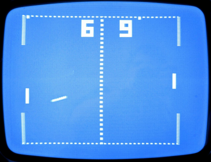

## Pong (Atari)

**Pong** (o Tele-Pong) es un videojuego de consolas de primera generación
publicado por Atari, creado por Nolan Bushnell y lanzado el 29 de noviembre de
1972. Está basado en el deporte de tenis de mesa (o ping pong). La palabra Pong
es una marca registrada por Atari Interactive, mientras que la palabra genérica
"pong" es usada para describir el género de videojuegos "bate y bola". La
popularidad de Pong dio lugar a una demanda de infracción de patentes y ganada
por parte de los fabricantes de Magnavox Odyssey, que poseía un juego similar en
el que Pong de Atari claramente se había inspirado luego de una visita de
Bushnell a las oficinas de Magnavox donde vio una demostración del mismo.

## Recursos

- Un artículo en [Wired](https://www.wired.com/story/) sobre [los orígenes de Pong](https://www.wired.com/story/inside-story-of-pong-excerpt/)

- [Fuente inspirada en Pong](https://fontstruct.com/fontstructions/show/2450791/pong-score-extended) (Para los números del _score_)

## Asteroids

### Información adicional

- [Asteroids, a Fluid Game Still Enjoyable Today](https://www.youtube.com/watch?v=UMGd1C5fNaE)

- [Asteroids - Wikipedia, la enciclopedia libre](https://es.wikipedia.org/wiki/Asteroids)

- ["Asteroids" by Atari: Classic Arcade Game Review - hubpages.com](https://discover.hubpages.com/games-hobbies/Asteroids-by-Atari-Classic-Video-Games-Reviewed)

### Créditos y recursos

- Colección inmensa de recursos para juegos: [OpenGameArt.org |](https://opengameart.org/)

- Fondo: [Perfectly Seamless Night Sky | OpenGameArt.org](https://opengameart.org/content/perfectly-seamless-night-sky)

- Bitmaps: [Asteroids vector-style sprites | OpenGameArt.org](https://opengameart.org/content/asteroids-vector-style-sprites)

- Sonidos: [Laser Fire | OpenGameArt.org](https://opengameart.org/content/laser-fire)

- [Fuente de pong extendida](https://fontstruct.com/fontstructions/show/2450791/pong-score-extended)
  por [https://fontstruct.com/fontstructors/2414584/randomfontstructuser
](randomfontstructuser).
